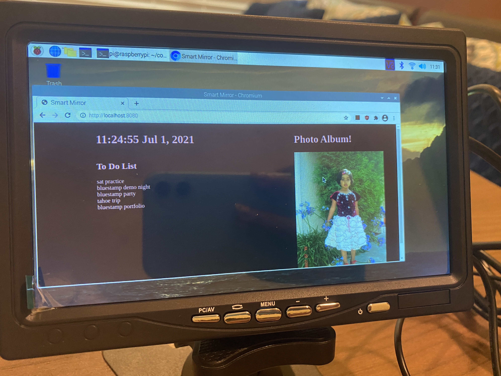

# Smart Watch Project
I am utilizing ESP32 Pico as well as several provided components including: IR Transmitter/Reciever, an LED, Buzzer, two buttons, as well as an LCD screen. This enables me to customize the ESP32 Pico to act as a mini computer which can fit on my wrist. With proper coding, I am able to turn the ESP32 Pico into a functioning Smartwatch with several features.

| **Engineer** | **School** | **Area of Interest** | **Grade** |
|:--:|:--:|:--:|:--:|
| Rushil R | Los Altos High SChool | Computer Science & Engineeing| Rising Junior

# Reflection
My time at BlueStamp was both fun and extremely informative. I learned so many new things from what a Rasperry Pi is and to how to use an API. Although I did not get to finish everything that I had planned for my Smart Mirror project, I learned so much and I'm very proud of what I was able to make in just three weeks. I really value all the lessons I learned this summer and I know that I will be using them again in the future. If you scroll below, you can see my journey working on this project and how I was able to tackle the problems I ran into. 

# Smart Mirror Monitor  
Final Design
<html>

</html>

Base Code Design
<html>

</html>

# Final Milestone
I reached my final milestone! My goal for this milestone was to format all the components on the screen in a visually aesthetic way, following the sketch I had previously made, and glue the physical peices of the mirror together. I was able to experiment with colors, fonts, and sizes until I was finally satisfied with how it looked. Unfortunately, I was not able to glue the mirror onto the monitor before my 3 weeks at BlueStamp was over. However, I am planning to finish that up and work on some additional components for my smart mirror as well. The components I want to add are the music player and text notification. With all the knowledge I gained at BlueStamp, I feel confident in my ability to keep improving the smart mirror. In the video below, I will be presenting my Smart Mirror, explaining my journey working on this project, and talking about this final milestone. Thank you so much for following me on this journey!

# Second Milestone

I reached my second milestone today! I finished working on the software and writing the code on Visual Studio Code. I have made the components for the time/date, todo list, and photo album, but because of time constraints, I am not going to be making the music player and text notifications components. If I have extra time after finishing my third milestone, I will add the music component. Writing the todo list code was the most difficult because I had to connect the API to my google calendar. However, the other two, time/date and photo album, were much easier. The layout of the monitor is similar to my sketch, and I am ready to place all of my parts together and finish my third milestone soon.

Closeup Picture
<html>

</html>

# First Milestone

I have reached my first milestone! This milestone involved the creation of my first ever screen on the smartwatch, a simple stopwatch. Before reaching this milestone, I had to set up the M5Stick Plus with an ESP32 Pico Kit installed. I first had to burn the ESP32 Pico, which enabled me to connect it to the wifi and the UIFlow Interface. This allowed me to code the stopwatch. In this stopwatch, we have three functions: Restart, Start, and Stop. Through the different types of button presses, I was able to code all of those three functions to one singular button on the Stick C. First, a singular press either Starts/Stops it depending on if the stopwatch is currently counting or not. Secondly, a longer press restarts the stopwatch to 0. Overall, I am proud of how far I have come in terms of being knowledgeable about how to code the M5Stick

Milestone I Video:
<iframe width="560" height="315" src="https://www.youtube.com/embed/CIY-Y0Lh2Yk" title="YouTube video player" frameborder="0" allow="accelerometer; autoplay; clipboard-write; encrypted-media; gyroscope; picture-in-picture; web-share" allowfullscreen></iframe>

In-depth picture:
<html>

</html>

# Starter Project

I finished my starter project! This project involved building an alarm clock from the basic instructions and materials provided. This project involved a lot of soldering as many of the components needed to be soldered onto the PCB in order for it to work. I found building this alarm clock to be extremely fun, as it was a big relief once it worked on the first attempt. I also found it interesting how each part has a function, and even the smallest parts can contribute mainly to the final functionality. As this was my first time soldering for a project, I am incredibly proud of myself for finishing the project with a high degree of quality.

<iframe width="560" height="315" src="https://www.youtube.com/embed/pBVsiNEepwE" title="YouTube video player" frameborder="0" allow="accelerometer; autoplay; clipboard-write; encrypted-media; gyroscope; picture-in-picture; web-share" allowfullscreen></iframe>
