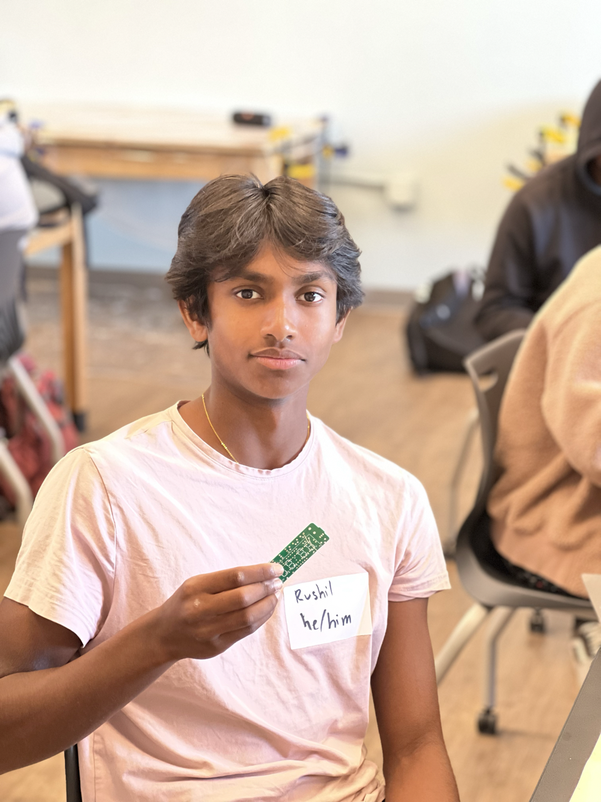

# Smart Watch Project 
I am utilizing ESP32 Pico as well as several provided components including IR Transmitter/receiver, an LED, Buzzer, two buttons, as well as an LCD screen. This enables me to customize the ESP32 Pico to act as a mini-computer which can fit on my wrist. With proper coding, I am able to turn the ESP32 Pico into a functioning Smartwatch with several feature. In addition, I decided to build a Bicycle Generator to charge my Smartwatch. This second project allows me to harvest electricity from the wheel's motion which turns as power is generated from my legs.

| **Engineer** | **School** | **Area of Interest** | **Grade** |
|:--:|:--:|:--:|:--:|
| Rushil R | Los Altos High School | Computer Science & Engineering| Rising Junior

<html>

</html>
<!-- # Reflection
My time at BlueStamp was both fun and extremely informative. I learned so many new things from what a Rasperry Pi is and to how to use an API. Although I did not get to finish everything that I had planned for my Smart Mirror project, I learned so much and I'm very proud of what I was able to make in just three weeks. I really value all the lessons I learned this summer and I know that I will be using them again in the future. If you scroll below, you can see my journey working on this project and how I was able to tackle the problems I ran into. 

 Smart Mirror Monitor  
Final Design
<html>

</html>

Base Code Design
<html>

</html>


# Final Milestone
I reached my final milestone! My goal for this milestone was to format all the components on the screen in a visually aesthetic way, following the sketch I had previously made, and glue the physical peices of the mirror together. I was able to experiment with colors, fonts, and sizes until I was finally satisfied with how it looked. Unfortunately, I was not able to glue the mirror onto the monitor before my 3 weeks at BlueStamp was over. However, I am planning to finish that up and work on some additional components for my smart mirror as well. The components I want to add are the music player and text notification. With all the knowledge I gained at BlueStamp, I feel confident in my ability to keep improving the smart mirror. In the video below, I will be presenting my Smart Mirror, explaining my journey working on this project, and talking about this final milestone. Thank you so much for following me on this journey!

[](https://www.youtube.com/watch?v=_TTp9rQcXJg&t=4s "Demo Night Vid") -->

# Second Milestone

I reached my second milestone today! I finished working on the software and writing the code on Visual Studio Code. I have made the components for the time/date, todo list, and photo album, but because of time constraints, I am not going to be making the music player and text notifications components. If I have extra time after finishing my third milestone, I will add the music component. Writing the todo list code was the most difficult because I had to connect the API to my google calendar. However, the other two, time/date and photo album, were much easier. The layout of the monitor is similar to my sketch, and I am ready to place all of my parts together and finish my third milestone soon.


[](https://www.youtube.com/watch?v=0PfWPwV4eSk "Milestone 2 Video")-->
# Third Milestone 

3D Views: 
<html>

</html>
<html>

</html>
<html>

</html>
Demonstration:
<iframe width="560" height="315" src="https://www.youtube.com/embed/kqAD4AKiqZA" title="YouTube video player" frameborder="0" allow="accelerometer; autoplay; clipboard-write; encrypted-media; gyroscope; picture-in-picture; web-share" allowfullscreen></iframe>

Milestone III Video:

<iframe width="560" height="315" src="https://www.youtube.com/embed/jhJolwuPPM4" title="YouTube video player" frameborder="0" allow="accelerometer; autoplay; clipboard-write; encrypted-media; gyroscope; picture-in-picture; web-share" allowfullscreen></iframe>

I reached my Third Milestone today. After deciding to utilize much more hardware with my time at Bluestamp, I proposed creating a bike generator for approval. This milestone of my project entails generating power from the bike. This project involved the design and development of a Bicycle Generator utilizing a custom-built mount, modified high-torque motors, a direct wheel-wheel connection, and a 0.9-5V USB Port Step Up Booster. Extensive research was conducted, including reviewing YouTube videos that showcased various methods, including the use of car batteries and alternators. However, safety concerns and the need for compatibility led to the decision of not using car alternators and batteries.

The research process involved evaluating different designs and gathering insights from YouTube videos. While videos demonstrated the use of car batteries and alternators, safety concerns arose due to their incompatibility with lower RPMs and potential electrical hazards. To ensure safety and optimize performance, the project team selected components specifically designed for bicycle power generation. The final design incorporated a custom mount, high-torque motors, a direct wheel-wheel connection, and a 0.9-5V USB Port Step Up Booster, providing a portable, efficient, and safe Bicycle Generator system.


# Second Milestone

Milestone II Video:

<iframe width="560" height="315" src="https://www.youtube.com/embed/vNwp13OvMRc" title="YouTube video player" frameborder="0" allow="accelerometer; autoplay; clipboard-write; encrypted-media; gyroscope; picture-in-picture; web-share" allowfullscreen></iframe>

Picture of Arduino Contraption
<html>

</html>


I reached my second milestone today! This milestone was marked by the completion of a couple of steps that are crucial to the development of a smartwatch, as well as some auxiliary features. Firstly, I developed a multiscreen capability within the watch, enabling the user to switch screens with the push of a button. This functionality enabled me to add a home screen to my watch, which included items necessary for a watch, such as date and time. To test this, I created a simple Arduino Infared detection machine. I have added a video of this functionality working below, as well as a picture of the Arduino contraption. Finally, I added an auxiliary feature which is awesome with watches, a built-in TV Remote. In the next milestone, I want to add a step counter, as it is a feature I enjoyed with my old FitBit.


# First Milestone

Milestone I Video:
<iframe width="560" height="315" src="https://www.youtube.com/embed/CIY-Y0Lh2Yk" title="YouTube video player" frameborder="0" allow="accelerometer; autoplay; clipboard-write; encrypted-media; gyroscope; picture-in-picture; web-share" allowfullscreen></iframe>

In-depth picture:
<html>

</html>

I have reached my first milestone! This milestone involved the creation of my first ever screen on the smartwatch, a simple stopwatch. Before reaching this milestone, I had to set up the M5Stick Plus with an ESP32 Pico Kit installed. I first had to burn the ESP32 Pico, which enabled me to connect it to the wifi and the UIFlow Interface. This allowed me to code the stopwatch. In this stopwatch, we have three functions: Restart, Start, and Stop. Through the different types of button presses, I was able to code all of those three functions to one singular button on the Stick C. First, a singular press either Starts/Stops it depending on if the stopwatch is currently counting or not. Secondly, a longer press restarts the stopwatch to 0. Overall, I am proud of how far I have come in terms of being knowledgeable about how to code the M5Stick


# Starter Project

<iframe width="560" height="315" src="https://www.youtube.com/embed/pBVsiNEepwE" title="YouTube video player" frameborder="0" allow="accelerometer; autoplay; clipboard-write; encrypted-media; gyroscope; picture-in-picture; web-share" allowfullscreen></iframe>

I finished my starter project! This project involved building an alarm clock from the basic instructions and materials provided. This project involved a lot of soldering as many of the components needed to be soldered onto the PCB in order for it to work. I found building this alarm clock to be extremely fun, as it was a big relief once it worked on the first attempt. I also found it interesting how each part has a function, and even the smallest parts can contribute mainly to the final functionality. As this was my first time soldering for a project, I am incredibly proud of myself for finishing the project with a high degree of quality.


# Code

```
from m5stack import *
from m5ui import *
from uiflow import *
import ntptime
from easyIO import *
import time
import unit


setScreenColor(0x000000)
gps_0 = unit.get(unit.GPS, unit.PORTA)


total = None
accX = None
Screen = None
accY = None
accZ = None
acceleration = None
stoppedTimer = None
average = None
Hours = None
count = None
width = None
state = None
Minutes = None
oldState = None
Steps = None
Seconds = None
currMilli = None


triangle0 = M5Triangle(65, 90, 41, 115, 92, 115, 0xFFFFFF, 0xFFFFFF)
currentTime = M5TextBox(78, 54, "00:00", lcd.FONT_DejaVu24, 0xFFFFFF, rotate=90)
triangle1 = M5Triangle(65, 50, 40, 75, 91, 75, 0xFFFFFF, 0xFFFFFF)
triangle2 = M5Triangle(65, 7, 39, 32, 90, 32, 0xFFFFFF, 0xFFFFFF)
battery = M5TextBox(130, 200, "label0", lcd.FONT_Default, 0xffffff, rotate=90)
label0 = M5TextBox(130, 0, "label0", lcd.FONT_DejaVu40, 0xFFFFFF, rotate=90)
Step = M5TextBox(100, 75, "0", lcd.FONT_DejaVu72, 0xFFFFFF, rotate=90)
label1 = M5TextBox(41, 92, "label1", lcd.FONT_DejaVu24, 0xFFFFFF, rotate=90)

from numbers import Number


# Describe this function...
def renderStopwatch():
  global total, accX, Screen, accY, accZ, acceleration, stoppedTimer, average, Hours, count, width, state, Minutes, oldState, Steps, Seconds, currMilli
  lcd.clear()
  lcd.fill(0x000000)
  loadBattery()
  circle0 = M5Circle(55, 70, 6, 0xFFFFFF, 0xFFFFFF)
  circle1 = M5Circle(85, 70, 6, 0xFFFFFF, 0xFFFFFF)
  circle2 = M5Circle(55, 150, 6, 0xFFFFFF, 0xFFFFFF)
  circle3 = M5Circle(85, 150, 6, 0xFFFFFF, 0xFFFFFF)

  Hour = M5TextBox(90, 13, "00", lcd.FONT_DejaVu40, 0xFFFFFF, rotate=90)
  Minute = M5TextBox(90, 92, "00", lcd.FONT_DejaVu40, 0xFFFFFF, rotate=90)
  Second = M5TextBox(90, 173, "00", lcd.FONT_DejaVu40, 0xffffff, rotate=90)


  stoppedTimer = True
  Hours = 0
  Minutes = 0
  Seconds = 0
  currMilli = 0
  while Screen == 1:
    wait(0.1)
    currMilli = (currMilli if isinstance(currMilli, Number) else 0) + 0.1
    if btnA.isPressed():
      homePressed()
      break
    else:
      if btnB.isPressed():
        wait(0.01)
        if stoppedTimer == True:
          stoppedTimer = False
        else:
          stoppedTimer = True
      if Seconds >= 59:
        Minutes = (Minutes if isinstance(Minutes, Number) else 0) + 1
        Seconds = -1
        if Minutes >= 59:
          Hours = (Hours if isinstance(Hours, Number) else 0) + 1
          Minutes = 0
          if Hours >= 24:
            Hours = 0
            Minutes = 0
            Seconds = 0
      if stoppedTimer == False:
        if currMilli >= 1:
          Seconds = (Seconds if isinstance(Seconds, Number) else 0) + 1
          currMilli = 0
      Hour.setText(str("{0:0=2d}".format(Hours)))
      Minute.setText(str("{0:0=2d}".format(Minutes)))
      Second.setText(str("{0:0=2d}".format(Seconds)))

# Describe this function...
def renderTVRemote():
  global total, accX, Screen, accY, accZ, acceleration, stoppedTimer, average, Hours, count, width, state, Minutes, oldState, Steps, Seconds, currMilli
  lcd.clear()
  lcd.fill(0x000000)
  loadBattery()
  while Screen == 3:
    if btnB.isPressed():
      M5Led.on()
      triangle0.setBgColor(0xff0000)
      wait_ms(100)
      triangle1.setBgColor(0xff0000)
      wait_ms(100)
      triangle2.setBgColor(0xff0000)
      irCodes= [19, 618, 644 , 56, 60, 587 , 37, 178, 30, 556, 9, 702, 774, 93, 217, 448]
      for i in range(len(irCodes)):
        ir.tx(0xE0E040BF, irCodes[i])
      triangle2.setBgColor(0x000000)
      wait_ms(100)
      triangle1.setBgColor(0x000000)
      wait_ms(100)
      triangle0.setBgColor(0x000000)
      M5Led.off()
    else:
      wait_ms(100)
      if btnA.isPressed():
        homePressed()
        break

# Describe this function...
def loadBattery():
  global total, accX, Screen, accY, accZ, acceleration, stoppedTimer, average, Hours, count, width, state, Minutes, oldState, Steps, Seconds, currMilli
  battery.setColor(0xffffff)
  battery.setText(str(map_value((axp.getBatVoltage()), 3.7, 4.1, 0, 100)))

# Describe this function...
def renderHome():
  global total, accX, Screen, accY, accZ, acceleration, stoppedTimer, average, Hours, count, width, state, Minutes, oldState, Steps, Seconds, currMilli
  lcd.clear()
  lcd.fill(0x000000)
  loadBattery()
  currentTime.setColor(0xffffff)
  label0.setColor(0xffffff)
  label1.setColor(0xffffff)
  label0.setText(str(ntp.weekday()))
  label1.setText(str(ntp.formatDate('-')))
  currentTime.setText(str(ntp.formatTime(':')))
  while Screen == 2:
    if btnA.isPressed():
      homePressed()
      break
    else:
      currentTime.setText(str(ntp.formatTime(':')))

# Describe this function...
def renderStepCounter():
  global total, accX, Screen, accY, accZ, acceleration, stoppedTimer, average, Hours, count, width, state, Minutes, oldState, Steps, Seconds, currMilli
  lcd.clear()
  lcd.fill(0x000000)
  Step.setColor(0xffffff)
  loadBattery()
  while Screen == 4:
    label0.setText('Speed')
    Step.setText(str(gps_0.speed_kph))
    wait(0.1)
    if btnA.isPressed():
      homePressed()
      break

# Describe this function...
def homePressed():
  global total, accX, Screen, accY, accZ, acceleration, stoppedTimer, average, Hours, count, width, state, Minutes, oldState, Steps, Seconds, currMilli
  Screen = (Screen if isinstance(Screen, Number) else 0) + 1
  if Screen == 1:
    renderStopwatch()
  if Screen == 2:
    renderHome()
  if Screen == 3:
    renderTVRemote()
  if Screen == 4:
    renderStepCounter()
  if Screen > 4:
    Screen = 1
    renderStopwatch()


ntp = ntptime.client(host='us.pool.ntp.org', timezone=(-7))
loadBattery()
Screen = 2
renderHome()
average = 1.1
count = average / 10
oldState = False
state = False
```

# Bill of Materials

| **Part** | **Note** | **Price** | **Link** |
|:--:|:--:|:--:|:--:|
| MStick C Plus| Act as actual computer for the smart watch | $19.95 | <a href="https://shop.m5stack.com/products/m5stickc-plus-esp32-pico-mini-iot-development-kit"> Link </a> |
| GPS | Enable GPS Capability for the MStick C Plus | $11.95 | <a href="https://shop.m5stack.com/products/mini-gps-bds-unit"> Link <\a> |
|2x4 Wood| Building Stationary Bike| $19.20 | <a href="https://www.lowes.com/pd/1-x-2-x-8-ft-Furring-Strip-Common-0-75-in-x-1-5-in-x-8-ft-Actual/1000427899?cm_mmc=shp-_-c-_-prd-_-lum-_-ggl-_-LIA_LUM_124_Structural-Lumber-_-1000427899-_-local-_-0-_-0&gclid=Cj0KCQjw1_SkBhDwARIsANbGpFtAd-we1lSvwaN78x59clr3OcGU8bmCRatfRCBO1pHcpH5e7rwH0V4aAtgXEALw_wcB&gclsrc=aw.ds"> Link </a> |
| Wood Screws | Holding Wood Together| $5.29 | <a href="https://www.amazon.com/Hillman-Group-47665-Drywall-Phillips/dp/B003W93800/ref=asc_df_B003W93800/?tag=hyprod-20&linkCode=df0&hvadid=167128911295&hvpos=&hvnetw=g&hvrand=15553456031409296407&hvpone=&hvptwo=&hvqmt=&hvdev=c&hvdvcmdl=&hvlocint=&hvlocphy=9032171&hvtargid=pla-310106512028&psc=1"> Link </a> |
| Bike | Bike | $348 | <a href="https://www.walmart.com/ip/Decathlon-Rockrider-ST50-21-Speed-Aluminum-Mountain-Bike-26-Unisex-Black-Small/867503072?wmlspartner=wlpa&selectedSellerId=0&adid=22222222227000000000&wl0=&wl1=g&wl2=c&wl3=42423897272&wl4=pla-51320962143&wl5=9032171&wl6=&wl7=&wl8=&wl9=pla&wl10=8175035&wl11=online&wl12=867503072&veh=sem&gclid=Cj0KCQjw1_SkBhDwARIsANbGpFv81HYpm2nDSU-Xtl1g5NPh5N1mXWtz-GzYoDLZg4MIYTpKHmcZK30aAhO-EALw_wcB"> Link </a> |
| High Torque Motor x2| Generating Electricity | $104 | <a href="https://www.digikey.com/en/products/detail/pololu-corporation/4758/11586926"> Link </a> |
| Bike Pegs| What the item is used for | $Price | <a href="https://www.amazon.com/Arduino-A000066-ARDUINO-UNO-R3/dp/B008GRTSV6/"> Link </a> |

